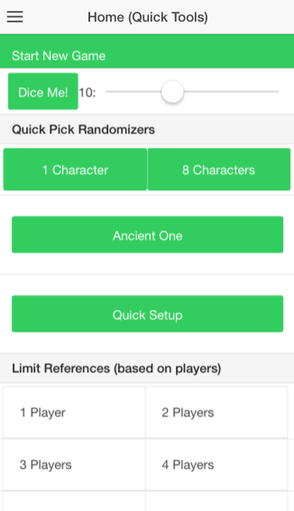
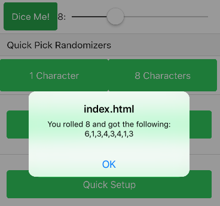
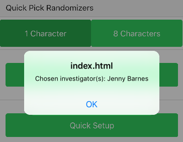
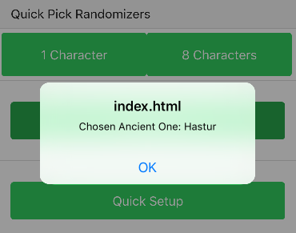
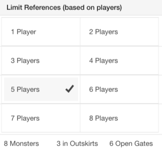
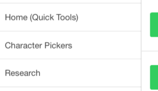
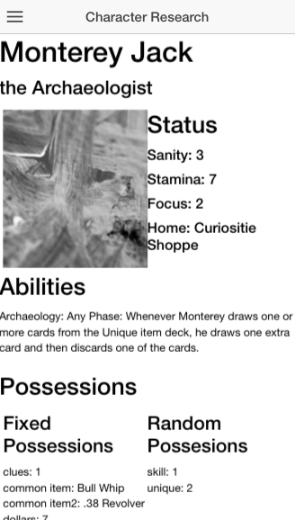

# Arkham-Adventure-App
This is an ionic refactor of my Arkham Adventure Site, built first for Android

## About
This was a personal project in mobile development working with Ionic and Cordova to create an app to help with the game Arkham Horror.

## Goals
Currently still working on getting it up and running with the base game, but future releases should have expansions worked in as well. More tasks will be added as need arises. Planned priorities are as follows:

#### Game
1. Being able to select from a limited pool of investigators instead of all available
2. Ability to track current game state for a single player
3. Keep up with environments and active rumors
4. Ability to track current game state for all players

#### Research
1. Heralds
3. Items
4. Locations/Encounters
5. Gates/Otherworld Encounters
6. Mythos
7. Monster Gallery (Bestiary)

#### Ambiance
1. Slang of the era
2. Music playlist to set the mood
3. Soundboard of effects

#### Victory (After the game)
1. Score Tally
2. Game stats gallery

## Requirements
Since it's an Ionic app, you will need Ionic & Cordova. These only run in Node version 4!
I used Node 4.2.6 and NPM 3.5.3 
You will also need Git/Github

## Installing
1. In the directory you want to install, Git Clone this repo
2. Change Directory into the cloned repo
3. Make sure you are in Node version ~4.2
4. In that main directory run `npm install`
5. Optional! Ionic preferes to be installed globally, so if you have issues getting the Ionic commands working try: `npm install -g cordova ionic` 

## Running
1. Change directory into the root of the cloned directory, 
2. `ionic platform add android`
3. `ionic platform add ios`
4. `ionic serve` OR `ionic emulate ios`
4. To install this on your android device you will need to download the proper Android SDK as well as enable developer mode on your device

## Usage
First priority was to get a few quick-tools complete, things that help speed up game setup for indecisive people. Randomizers to select an investigator, select every investigator, or an ancient one, as well as a complete select all option. This serves as the Home screen.

On this screen you can roll a selected number of dice,

Or you can press a button to randomly select options for the game

You can also see the limits of the game based on how many players there are, as a quick reference.

The menu slides out from the left revealing navigation options.

Character status and information is also available in the Research section, so that you can review and research which characters you like (in case another player is hogging the stack).

